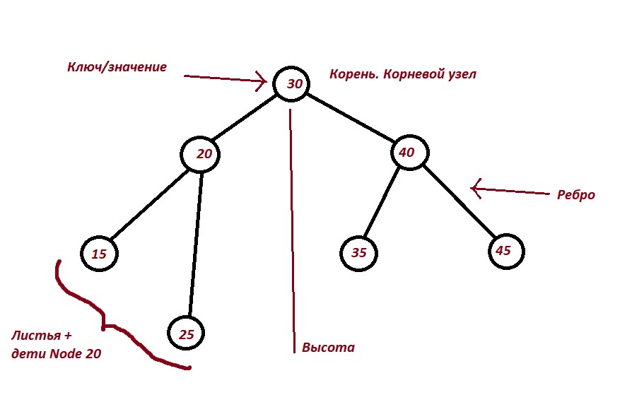
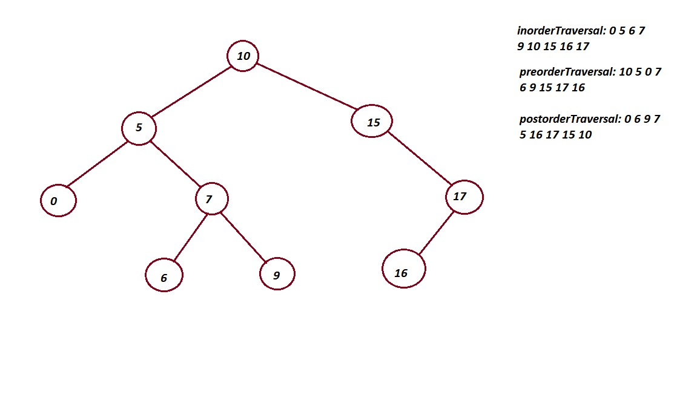

# Бинарные деревья поиска #
_Дерево_ - иерархическая структура данных, имеющая узлы и ребра, соединяющие эти узлы.

_Узел_ - своего рода нода. В нём есть ключ или значение, указатели на дочерние узлы.

_Лист_ - узел без дочерних узлов. Указатель на дочерние - null.

_Корень_ - самый верхний узел дерева. Так же - корневой узел.

_Ребро_ - указатель, связывающий __два__ узла.

## Двоичное дерево. Определение ##

_Двоичное дерево_ - древовидная структура данных, в которой у родителя не может быть более двух детей.



## Структура для представления двоичного дерева ##

1. Узел дерева может хранить внутри себя значение, а так же указатель только на правый и левый детей.

```
struct Node {
    int data;
    Node *left;
    Node *right;
}
```

2. Узел может хранить так же указатель на родителя (выстраивается связь, как в двусвязном списке).

```
struct Node {
    int data;
    Node *left;
    Node *right;
    Node *parent;
}
```

## Двоичное дерево поиска ##

_Двоичное дерево поиска_ - двоичное дерево, для которого выполняются следующие условия (свойства дерева):
1. Для узла X левое поддерево содержит все значения, меньше или равные ему самому;
2. Для узла X правое поддерево содержит все значения, больше или равные ему самому;
3. Правое и левое поддеревья - двоичные деревья поиска.

## Операции с деревьями поиска ##

### Поиск элемента. __O(h)__ ###

_Описание алгоритма:_ 

1. Для каждого узна, начиная с корня, значение ключа сравнивается с ключом искомым;
2. дальше два исхода: ключи одинаковые - возвращаем Node, включи не совпали - рекурсивно вызывается поиск для правого либо левого поддерева (левое - <, правое - >).
3. Если элемент, передается в поиск как null - возвращаем null.

``` C++
Node search (Node x, int k) {
    if (x == nullptr || k = x.key){
        return x;
    }

    if (k < x.key) {
        return search(x.left, k);
    }
    else {
        return search(x.right, k);
    }
}
```

### Добавление элемента. __O(h)__ ###

_Описание алгоритма:_ 

Аналогично поиску. Только теперь, когда мы доходим до null - подвешиваем элемент.

``` C++
Node insert (Node x, int z) {
    if (x == nullptr){
        return Node(z);
    }

    if (z < x.key) {
        x.left = insert(x.left, z);
    }
    else if (z > x.right) {
        x.right = insert(x.right, z);
    }

    return z;
}
```

Вторая реализация - использование информации о родителе. По пути вниз нужно запоминать путь.

``` C++
void insert(Node x, int z) {
    while (x != nullptr) {
        if (z.key > x.key) {
            if (x.right != nullptr) {
                x = x.right;
            }
            else {
                z.parent = x;
                x.right = z;
                break;
            }
        }
        else if (z.key < x.key) {
            if (x.left != nullptr) {
                x = x.left;
            }
            else {
                z.parent = x;
                x.left = z;
                break;
            }
        }
    }
}
```

### Поиск минимума. __O(h)__ ###

Чтобы найти минимальный элемент - необходимо с корня пройти как можно левее по дереву, пока не встретится нода с указателем на null.

```C++
Node min(Node x) {
    if (x.left == nullptr) {
        return x;
    }

    return min(x.left);
}
```

### Поиск максимума. __O(h)__ ###

Чтобы найти максимальный элемент - необходимо с корня пройти как можно правее по дереву, пока не встретится нода с указателем на null.

```C++
Node max(Node x) {
    if (x.right == nullptr) {
        return x;
    }

    return min(x.right);
}
```

### Поиск следующего элемента. __O(h)__ ###

Следующий элемент некоторого элемента k - элемент, ключ которого минимален и больше ключа элемента k.

__Алгоритм действия__: если у ноды есть правое поддерево, то следующий за ним элемент будет минимальным элементом в этом поддереве. Если нет правого поддерева, то нужно следовать вверх, пока не встретим узел, который является левым дочерним узлом своего родителя. 

_С информацией о родителе:_

```
Node next(x : Node):
   if x.right != null
      return minimum(x.right)
   y = x.parent
   while y != null and x == y.right
      x = y
      y = y.parent
   return y
```

_Без информации о родителе:_

```
Node next(x : T):
   Node current = root, successor = null    // root — корень дерева
   while current != null
      if current.key > x
         successor = current
         current = current.left
      else
         current = current.right
   return successor
```

### Поиск предыдущего элемента. __O(h)__ ###

Выполняется аналогично. Если у узла есть левое поддерево, то предыдущий ему элемент будет максимальным элементом в этом поддереве. Если у него нет левого поддерева, то нужно следовать вверх, пока не встретим узел, который является правым дочерним узлом своего родителя.

_С информацией о родителе:_

```
Node prev(x : Node):
   if x.left != null
      return maximum(x.left)
   y = x.parent
   while y != null and x == y.left
      x = y
      y = y.parent
   return y
```

### Удаление элемента. __O(h)__ ###

1. Удаление листа - заменяем указатель на _null_;
2. Удаление узла с одним дочерним узлом - вставляем дочерний узел вместо удаляемого; 
3. Удаление узла с двумя дочерними узлами - находим следующий за удаляемым элемент и удаляем его, после чего вставляем найденный элемент вместо удаляемого. 

_Нерекурсивно:_

```
func delete(t : Node, v : Node):                 // t — дерево, v — удаляемый элемент
   p = v.parent                                  // предок удаляемого элемента
   if v.left == null and v.right == null         // первый случай: удаляемый элемент - лист
     if p.left == v
       p.left = null
     if p.right == v
       p.right = null
   else if v.left == null or v.right == null     // второй случай: удаляемый элемент имеет одного потомка
       if v.left == null                 
           if p.left == v
             p.left = v.right
           else
             p.right = v.right
           v.right.parent = p 
       else
           if p.left == v
               p.left = v.left
           else
               p.right = v.left
           v.left.parent = p
   else     // третий случай: удаляемый элемент имеет двух потомков
     successor = next(v, t)                   
     v.key = successor.key
     if successor.parent.left == successor
       successor.parent.left = successor.right
       if successor.right != null
         successor.right.parent = successor.parent
     else
       successor.parent.right = successor.right
       if successor.right != null
         successor.right.parent = successor.parent
```

_Рекурсивно:_ при рекурсивном удалении узла из бинарного дерева нужно рассмотреть три случая: удаляемый элемент находится в левом поддереве текущего поддерева, удаляемый элемент находится в правом поддереве или удаляемый элемент находится в корне. В двух первых случаях нужно рекурсивно удалить элемент из нужного поддерева. Если удаляемый элемент находится в корне текущего поддерева и имеет два дочерних узла, то нужно заменить его минимальным элементом из правого поддерева и рекурсивно удалить этот минимальный элемент из правого поддерева. Иначе, если удаляемый элемент имеет один дочерний узел, нужно заменить его потомком.

```
Node delete(root : Node, z : T):               // корень поддерева, удаляемый ключ
  if root == null
    return root
  if z < root.key
    root.left = delete(root.left, z)
  else if z > root.key
    root.right = delete(root.right, z)
  else if root.left != null and root.right != null
    root.key = minimum(root.right).key
    root.right = delete(root.right, root.key)
  else
    if root.left != null
      root = root.left
    else if root.right != null
      root = root.right
    else
      root = null
  return root
```

### Является ли деревом поиска? __О(n)__, n - количество вершин ###

_Описание:_ для проверки нужно убедиться, существует ли хотя бы одна вершина, нарушающая свойство дерева.

```
bool isBinarySearchTree(root: Node):                    // Здесь root — корень заданного двоичного дерева.

  bool check(v : Node, min: T, max: T):                 // min и max — минимально и максимально допустимые значения в вершинах поддерева.
    if v == null                    return true
    if v.key <= min or max <= v.key return false
    return check(v.left, min, v.key) and check(v.right, v.key, max)

  return check(root, −∞, ∞)
```

### Обходы дерева поиска. __О(n)__, n - количество вершин ###

Есть три операции обхода узлов дерева, отличающиеся порядком обхода узлов:

1. inorderTraversal — обход узлов в отсортированном порядке:
```
func inorderTraversal(x : Node):
   if x != null
      inorderTraversal(x.left)
      print x.key
      inorderTraversal(x.right)
```

2. preorderTraversal — обход узлов в порядке: вершина, левое поддерево, правое поддерево:

```
func preorderTraversal(x : Node)
   if x != null
      print x.key
      preorderTraversal(x.left)
      preorderTraversal(x.right)
```

3. postorderTraversal — обход узлов в порядке: левое поддерево, правое поддерево, вершина:

```
func postorderTraversal(x : Node)
   if x != null
      postorderTraversal(x.left)
      postorderTraversal(x.right)
      print x.key
```

