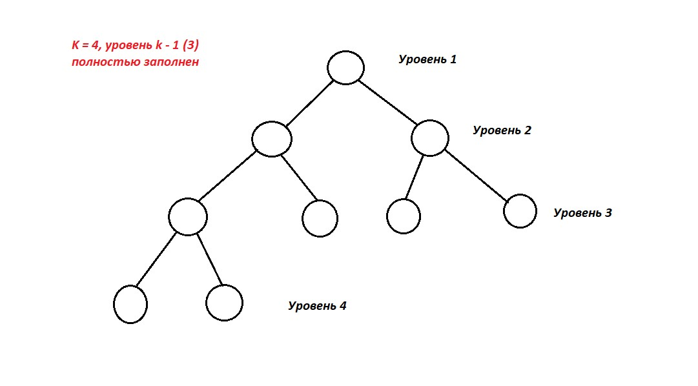
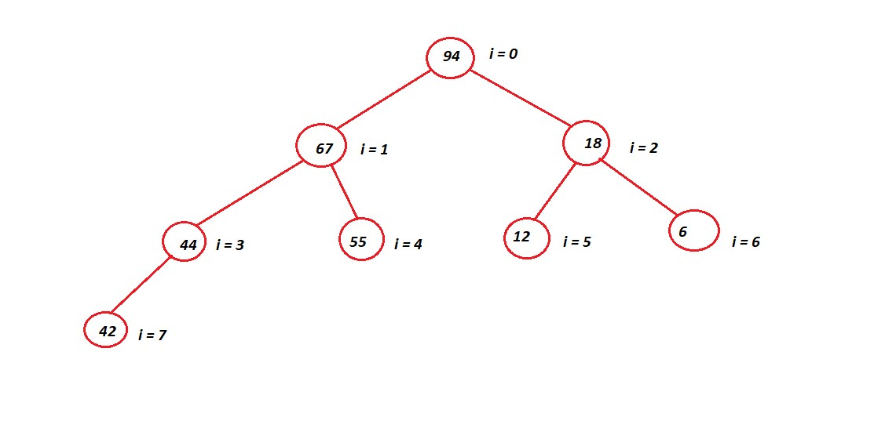
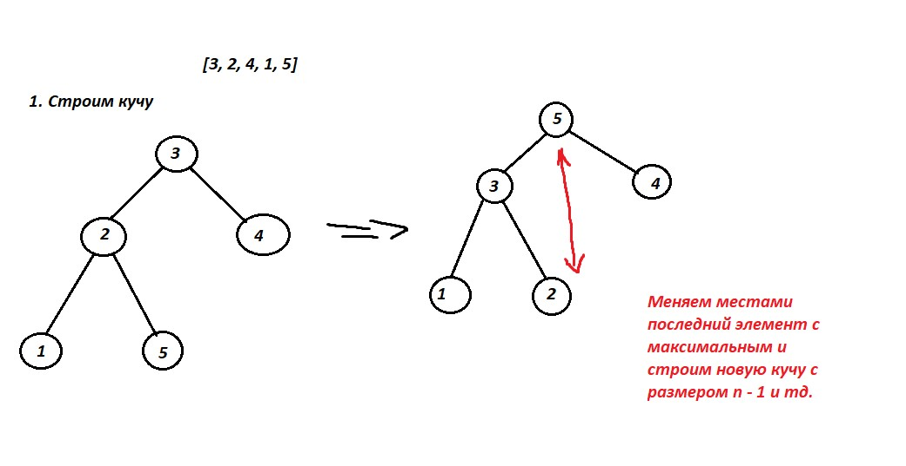

## Heap ##

Пирамида - Heap - это бинарное дерево высоты k, удовлетворяющее следующим условиям:

1. Узлами дерева являются элементы массива;
2. Дерево является сбалансированным, то есть все личтья имеют глубину ```k``` или ```k - 1```, при этом уровень ```k - 1``` полностью заполнен, а уровень ```k``` заполнен слева направо, то есть форма пирамиды выглядит следующим образом: 
3. Выполняются свойства пирамиды (меняются немного в зависимости от того, убывающая или возрастающая):
- Каждый элемент меньше либо равен родителю;
- Корнем дерева является максимальный элемент массива.



Для пирамиды не требуется создавать специальную структуру данных - можно хранить прямо в сортируемом массиве:
```
Есть массив a

a[0] - корень дерева.
Дети элемента i - a[2i + 1] и a[2i + 2]
```
Разберем на примере: 
```
[94, 67, 18, 44, 55, 12, 6, 42]

a[0] = 94 - корень дерева
i = 0, дети корня - a[2 * 0 + 1] = 67, a[2 * 0 + 2] = 18

Теперь смотрим детей для a[1] и a[2]. 
1. i = 1 => a[2 * 1 + 1] = 44, a[2 * 1 + 2] = 55
2. i = 2 => a[2 * 2 + 1] = 12, a[2 * 2 + 2] = 6

Так продолжаем до конца (на самом деле достаточно смотреть, не вышли ли мы за n - число элементом в массиве).
```


Далее рассмотрим, как вернуть свойство упорядоченности для кучи при изменении/удалении/добавлении нового элемента.

Есть два способа. 
1. Если значение измененного элемента увеличивается, то используем ```siftDown``` - проссеивание вниз.
```heapSize``` — количество элементов в куче, 
```left, right``` - дети

```
function siftDown(i : int):
    while 2 * i + 1 < a.heapSize    
        left = 2 * i + 1             
        right = 2 * i + 2            
        j = left
        if right < a.heapSize and a[right] < a[left]
            j = right
        if a[i] <= a[j]
            break
        swap(a[i], a[j])
        i = j
```
Работает следующим образом (здесь указан способ для возрастающего дерева): если i-ый элемент меньше, чем его дети, то всё поддерево - уже куча. В противном случае меняем местами i-ый элемент с наименьшим из его детей, после чего выполняется siftDown для выброанного ребенка (после свапа мы могли нарушить свойство упорядоченности). ```O(logn)```

2. Если значение измененного элемента уменьшается, то свойства кучи восстанавливаются функцией ```siftUp```.

```
function siftUp(i : int):
    while a[i] < a[(i - 1) / 2]     // i = 0 — мы в корне
        swap(a[i], a[(i - 1) / 2])
        i = (i - 1) / 2
```
Работает следующим образом: если элемент больше своего родителя, то ничего делать не нужно. Иначе - меняем местами. После этого выполняем функцию для родителя. Иными словами - самый маленький элемент всплывает вверх. ```O(logn)``` 

### Извлечение минимального элемента ```O(logn)``` ###
```
int extractMin():
    int min = a[0]
    a[0] = a[a.heapSize - 1]
    a.heapSize = a.heapSize - 1
    siftDown(0)
    return min
```
Выполняет извлечение минимального элемента из кучи за время ```O(logn)```. Извлечение выполняется в четыре этапа:

1. Значение корневого элемента (он и является минимальным) сохраняется для последующего возврата.
2. Последний элемент копируется в корень, после чего удаляется из кучи.
3. Вызывается siftDown для корня.
4. Сохранённый элемент возвращается.

### Добавление нового элемента ```O(logn)``` ###
```
function insert(key : int):
    a.heapSize = a.heapSize + 1
    a[a.heapSize - 1] = key
    siftUp(a.heapSize - 1)
```

### HeapSort - пирамидальная сортировка, сортировка кучей ```O(nlogn)```###

1. ```O(1)``` - доп память.
2. n - количество элементов для сортировки.
3. Неустойчивый.
4. На почти отсортированных данных работает так же долго.

Смысл работы:

1. Имеем массив ```a[n - 1]```, который необходимо отсортировать.
2. Строим кучу, в которой корень - максимальный элемент.
3. Меняем местами последний элемент и корень дерева, чтобы поставить наш максимальный элемент на своё место. После этого уменьшаем размер кучи на 1.
4. Вызываем ```siftDown(0)``` => сформируем новую кучу.
5. Выполняем эти все пункты, пока размер кучи не станет равным 1.

В следующей функции мы, по сути, занимаемся тем, что меняем массив при построении кучи, чтобы выполнялись условия. Мы меняем массив так, как нужно, в итоге получаем кучу с максимальным элементом наверху.
```
fuction buildHeap(A, n):
    Heapsize <- n
    i <- Heapsize
    for i = [n/2] down to 1
       Heapify(A, i)
```

``` 
fun heapSort(A : list <T>):
   buildHeap(A)
   heapSize = A.size
   for i = 0 to n - 1
     swap(A[0], A[n - 1 - i])
     heapSize--
     siftDown(A, 0, heapSize)
```


